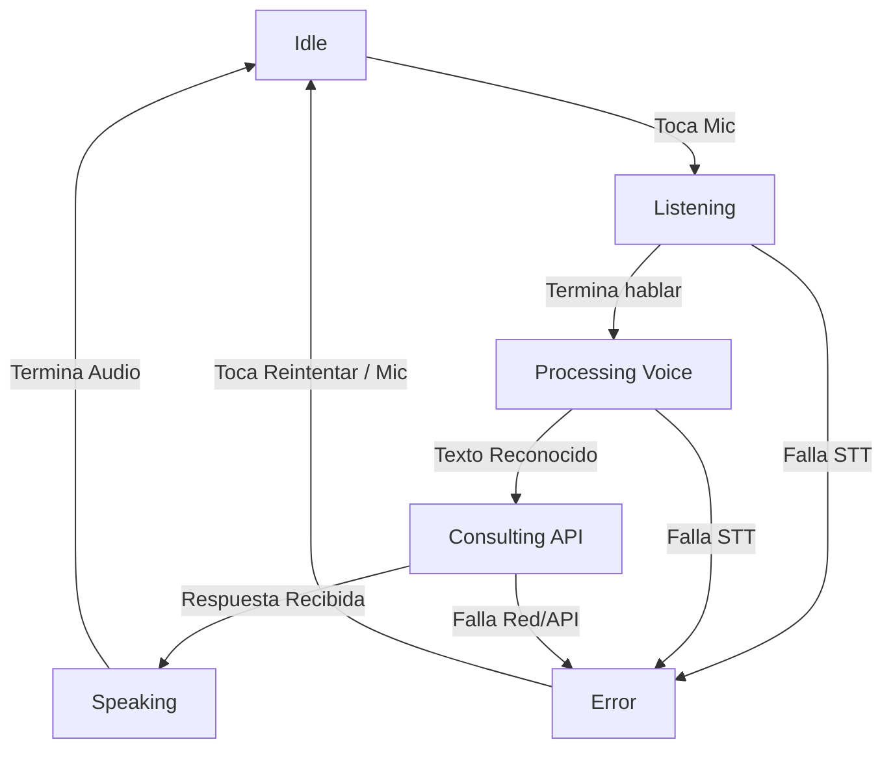

# Sprint 10 y Sprint 5 - Conversación Completa y Manejo de Errores

## Objetivo
Lograr el flujo conversacional completo en la aplicación PTAH integrando Texto y Voz (STT y TTS). La aplicación soporta interacción multimodal sin romperse y sin dejar al usuario en estados inconsistentes. 
Adicionalmente, este sprint incluye la robustez solicitada en el Sprint 5 (Manejo de Errores), implementando interceptores de red, control de latencias y corrutinas preparadas para manejar fallas y tiempos de espera de forma limpia.

## Arquitectura

El flujo de voz y texto se unifica en el `ChatViewModel`, que actúa como única fuente de la verdad para el estado de la UI (mediante `ConversationState`).
El flujo general es:
`STT (SpeechRecognizerManager) -> ViewModel (State) -> Repository (OkHttp/Retrofit) -> ViewModel (State) -> TTS (AndroidTextToSpeechManager)`

El texto ingresado por teclado y el ingresado por voz terminan llamando al mismo punto de consulta en el ViewModel (`executeQuery`), garantizando reutilización y evitando lógica de negocio duplicada.

## Máquina de Estados

La coordinación de estados mutuamente excluyentes previene bugs como tener el micrófono activo mientras la IA está reproduciendo audio.

## Flujos Soportados
La aplicación garantiza cuatro combinaciones fluidas:
1. **Voz → Voz**: Usuario habla, el texto se autoenvía, y la respuesta es autoleída por el asistente.
2. **Texto → Voz**: El usuario tipea. Si la "Voz Automática" está activada en la barra superior, la respuesta se lee en voz alta al llegar.
3. **Voz → Texto**: El usuario habla, se autoenvía, y si la "Voz Automática" está desactivada, simplemente se muestra en pantalla.
4. **Texto → Texto**: Flujo clásico, sin interrupciones del motor de voz.

## Coordinación STT/TTS
Para evitar que el asistente se grabe a sí mismo:
- Si el usuario toca el micrófono mientras el estado es `Speaking` (TTS reproduciendo), el TTS **se interrumpe automáticamente** antes de que el STT empiece a grabar (`speechOutput.stop()`).
- Mientras se graba, no se reproducen respuestas encoladas.
- La fuente de entrada se trackea mediante `InputOrigin` (KEYBOARD o VOICE) para determinar si la respuesta debe ser autoleída de forma inteligente.

## Manejo de Errores (Sprint 5)

La capa de red (Retrofit y OkHttp) ha sido blindada:
- **Timeouts Explícitos:** 15s connect, 30s read, 15s write.
- **Intercepción:** `ErrorInterceptor` captura respuestas no exitosas (4xx y 5xx) y las mapea a mensajes en español.
- **Try/Catch en Repositorio:** El `PtahRepositoryImpl` envuelve la consulta en un `try/catch` capturando `HttpException` (Retrofit) y `IOException` (Fallas de red/conexión).
- **Recuperación Visual:** `ChatViewModel` emite el error hacia `ChatScreen`, que levanta un `Snackbar` temporal dando al usuario un botón de **Reintentar** que repite automáticamente la última consulta.

> **Guía Técnica de Testing (Errores 500 y Timeouts):**
> 1. Para forzar un **Timeout localmente**, puedes alterar temporalmente la configuración de RetrofitProvider en tu entorno local reduciendo el timeout a `1 milisegundo` (`connectTimeout(1, TimeUnit.MILLISECONDS)`).
> 2. Para forzar un **Error 500**, modifica tu API Key a una cadena errónea, lo cual arrojará un 401; o utiliza un servidor local mockeado en Python (`python -m http.server`) que deliberadamente retorne código 500. El interceptor capturará esto.

## Métricas
El flujo completo ahora se monitorea y se provee en `ConversationMetrics`, registrando:
- `sttLatencyMs`: Duración del reconocimiento de voz.
- `apiLatencyMs`: Tiempo de respuesta del servidor (Groq).
- `ttsLatencyMs`: Duración de la síntesis de voz.
- `totalLatencyMs`: Tiempo total de extremo a extremo desde el dictado hasta que termina la locución.

Se muestra un indicador visual amigable en la UI cuando finaliza la interacción.

## Testing

Se implementaron pruebas unitarias en `ChatViewModelTest` validando el auto-envío de STT y el cortafuegos STT/TTS. Además de esto, deben realizarse pruebas manuales físicas.

| Caso | Entrada | Salida Esperada |
|------|---------|-----------------|
| Voz a Voz | Tocar mic, decir "Hola" | "Hola" en UI, respuesta en UI, asistente la reproduce por audio, fin del flujo. |
| Interrupción TTS | Mientras TTS habla, tocar mic | Audio se detiene inmediatamente, banner "Escuchando" aparece. |
| Modo Híbrido | Tocar mic, dictar "Ley", desactivar auto-voz y dictar de nuevo | Primera respuesta leída, segunda respuesta solo escrita. |
| Corte de Internet (Test S5) | Apagar WiFi en Consulting | Snackbar: "Error de red. Verifica conexión" + Botón Reintentar. |
| Timeout (Test S5) | Red lenta / Config timeout=1ms | Snackbar: "Tiempo de espera superado" + Botón Reintentar. |
