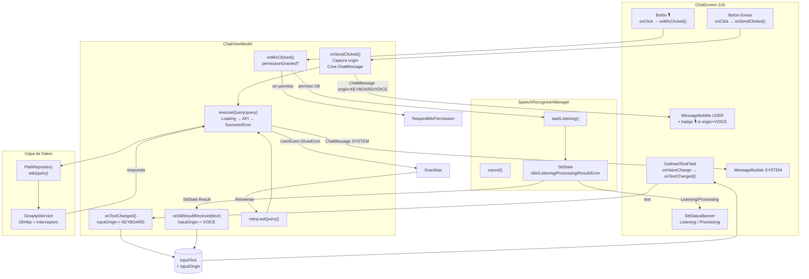

 # Documentación Técnica – Sprint 8: STT Integrado al Flujo Conversacional

**Proyecto:** PTAH Android  
**Sprint:** 8 – STT Integrado al Flujo Conversacional  
**Fecha:** Segundo cuatrimestre 2026

---

## 1. Objetivo del Sprint

Integrar el módulo de reconocimiento de voz (STT, implementado en el Sprint 7) al flujo conversacional principal de la app, garantizando que:

- El texto dictado por voz y el texto escrito por teclado usan **exactamente la misma tubería** de procesamiento en el `ChatViewModel` y en el `PtahRepository`.
- No existe lógica duplicada de envío entre los dos canales de entrada.
- La UI diferencia visualmente los mensajes enviados por voz de los escritos a mano.
- El flujo siempre incluye un paso de revisión/edición antes del envío.

---

## 2. Flujo Completo Implementado

```
[Usuario habla]                     [Usuario escribe]
       │                                    │
  onMicClicked()                    onTextChanged()
       │                                    │
SpeechRecognizerManager                     │
       │                                    │
SttState.Result(text)                       │
       │                                    │
onSttResultReceived(text)                   │
  inputOrigin = VOICE               inputOrigin = KEYBOARD
       │                                    │
       └───────────────┬────────────────────┘
                       │
                 inputText (estado único)
                   + inputOrigin
                       │
           ┌───────────┴──────────────┐
           │  Usuario revisa / edita  │
           │  (campo editable)        │
           └───────────┬──────────────┘
                       │
                 onSendClicked()
                       │
         Captura: origin = inputOrigin
         Agrega: ChatMessage(USER, text, origin)
         Limpia: inputText = ""
         Resetea: inputOrigin = KEYBOARD
                       │
                 executeQuery(text)
                       │
              PtahRepository.ask(query)
                       │
                   Groq API
                       │
          ChatMessage(SYSTEM, answer)
                       │
              Historial de chat
```

---

## 3. Arquitectura Unificada — Diagrama Mermaid



---

## 4. Cambios por Archivo — Sprint 8

### `ChatUiState.kt`

**Cambio:** Se agregó el enum `InputOrigin` y el campo `origin: InputOrigin` en `ChatMessage`.

```kotlin
// NUEVO
enum class InputOrigin { KEYBOARD, VOICE }

// MODIFICADO (nuevo campo con default para no romper código existente)
data class ChatMessage(
    val author: Author,
    val text: String,
    val origin: InputOrigin = InputOrigin.KEYBOARD
)
```

**Por qué:** Permite que la UI distinga en la burbuja si el mensaje fue dictado o escrito, sin que la capa de datos conozca nada sobre STT.

---

### `ChatViewModel.kt`

**Cambios principales:**

1. **`onSttResultReceived(text)`** — función pública explícita que recibe el resultado STT.
   - Es el **único punto de unión** entre la tubería de voz y la de texto.
   - Asigna `inputText = text` y `inputOrigin = VOICE`.
   - Reemplaza la asignación directa que había en el bloque `init` (que era correcto pero no testeable ni documentado como interfaz pública).

2. **`inputOrigin: InputOrigin`** — nuevo estado observable.
   - Se resetea a `KEYBOARD` al editar manualmente o al enviar.
   - Se captura en `onSendClicked()` antes de limpiar el input.

3. **`onTextChanged()`** — resetea `inputOrigin = KEYBOARD` si el usuario edita.
   - Así un mensaje dictado y luego editado no muestra el badge de voz.

4. **`onSendClicked()`** — captura `val origin = inputOrigin` antes de limpiar.
   - Pasa el origin al `ChatMessage` del usuario.

**Invariante garantizada:**
> `executeQuery()` nunca sabe si la consulta vino por voz o teclado. Solo recibe un `String`. La distinción termina en `ChatMessage`.

---

### `ChatScreen.kt`

**Cambios principales:**

1. **`MessageBubble`** — muestra badge 🎙️ + texto "por voz" bajo el contenido del mensaje cuando `message.origin == VOICE`.
   - `contentDescription = "Enviado por voz"` para accesibilidad.
   - Ícono y texto con opacidad reducida para no competir con el contenido.

2. **`SttStatusBanner`** — animación mejorada:
   - `slideInVertically + fadeIn` al aparecer (antes solo `fadeIn`).
   - `slideOutVertically + fadeOut` al desaparecer.
   - `liveRegion = LiveRegionMode.Polite` para que TalkBack anuncie el cambio de estado.

3. **`InputRow`** — feedback visual del origen:
   - Label dinámico: `"Consulta (por voz)"` cuando el texto viene de STT.
   - Placeholder dinámico: `"Texto reconocido por voz — podés editarlo"`.
   - Borde de color secundario cuando el texto es de origen voz.
   - `contentDescription` dinámico en el campo para TalkBack.

---

## 5. Estados del Micrófono — Tabla Visual

| Estado `SttState` | Botón mic | Banner | Campo de texto | Badge en burbuja al enviar |
|-------------------|-----------|--------|----------------|---------------------------|
| `Idle` | 🎙️ azul (tappable) | Oculto | Editable, label "Consulta" | — |
| `Listening` | 🔴 rojo (tappable = cancelar) | 🔴 "Escuchando..." + punto pulsante + ❌ | Editable | — |
| `Processing` | ⏳ spinner (deshabilitado) | ⏳ "Procesando voz..." | Editable | — |
| `Result(text)` | 🎙️ azul | Oculto | Lleno con texto, borde secundario, label "(por voz)" | 🎙️ "por voz" SI no edita |
| `Error(msg)` | 🎙️ azul | Oculto | Sin cambios | — |
| `PermissionDenied` | 🎙️ azul | Oculto | Sin cambios (Snackbar) | — |

---

## 6. Handovers por Rol

### Para Mateo — Casos de borde técnicos a verificar

**Prioridad alta:**

| # | Caso de borde | Dónde observar | Qué buscar en Logcat |
|---|---------------|----------------|---------------------|
| 1 | Reconocimiento vacío (silencio) | E2E-05 de la matriz | `onError código=6` (SPEECH_TIMEOUT) o `onError código=7` (NO_MATCH) |
| 2 | Cancelación durante `Processing` | El botón ❌ se oculta en Processing | El estado no debería poder cancelarse; verificar que el botón es invisible |
| 3 | Segunda consulta STT mientras `executeQuery` está en curso | Tocar mic mientras hay Loading | El mic debe funcionar independientemente del estado de la API |
| 4 | Reconocimiento concurrente (doble tap mic rápido) | Tocar mic 2 veces rápido | `SpeechRecognizerMgr: Destruyendo...` debe aparecer antes del segundo `Iniciando...` |
| 5 | Texto STT con caracteres especiales | Dictar "¿Cuántos días?" | El campo debe mostrar tildes y puntuación sin corrupción |

**Logcat tags esenciales:**
```
adb logcat -s SpeechRecognizerMgr ChatViewModel PtahLatency
```

**Cómo forzar timeout de red en la API (E2E-04b):**
1. Cambiar temporalmente `BASE_URL` en `RetrofitProvider.kt` a `http://10.0.2.2:3000/`.
2. Ejecutar: `python mock_server/app_mock.py`
3. Hacer POST a `http://localhost:3000/timeout` → la app dispara `SocketTimeoutException` tras ~15s.
4. La app debe mostrar el Snackbar "Tiempo de espera agotado. Verificá tu conexión."

**Cómo forzar Error 500:**
1. Con el mock server corriendo, cambiar `BASE_URL` al mock.
2. Hacer POST a `http://localhost:3000/error500`.
3. La app debe mostrar el Snackbar con el mensaje del `ErrorInterceptor`.

---

### Para Jesús — Interacción visual definitiva

**El flujo visual completo de una consulta por voz es:**

```
1. [Idle] → Botón 🎙️ azul en la InputRow, campo con label "Consulta"

2. [Tap mic] → Si NO tiene permiso: diálogo del sistema → Si concede → paso 3
                                                         → Si niega → Snackbar

3. [Listening] → Banner aparece con slide + fade desde abajo
                  Banner: fondo errorContainer, punto rojo pulsante, "Escuchando...", ❌ Cancelar
                  Botón mic: 🔴 rojo (MicOff icon), tappable para cancelar

4. [Usuario habla] → Nada cambia visualmente (el motor procesa)

5. [Fin de habla] → Banner: punto pulsante → spinner, texto "Procesando voz..."
                    Botón mic: ⏳ spinner, deshabilitado

6. [Resultado] → Banner desaparece (slide + fade hacia abajo)
                  Campo: se llena con el texto reconocido
                  Label del campo: "Consulta (por voz)"
                  Borde del campo: color secundario (sutil diferenciación)
                  Placeholder adicional: "Texto reconocido por voz — podés editarlo"
                  Botón mic: vuelve a 🎙️ azul

7. [Usuario revisa] → Puede editar (label vuelve a "Consulta", borde estándar)
                      Puede dejar sin editar

8. [Tap Enviar] → Burbuja aparece con el texto
                   Si no editó → badge 🎙️ + "por voz" (pequeño, semi-transparente)
                   Si editó    → sin badge (texto tratado como teclado)
```

**Notas de accesibilidad implementadas:**
- Banner usa `liveRegion = Polite` → TalkBack anuncia "Escuchando. Hablá ahora."
- Botón mic tiene `contentDescription` dinámico según el estado.
- Campo de texto tiene `contentDescription` dinámico según origen.
- Badge tiene `contentDescription = "Enviado por voz"` en el Row padre.

---

### Para Joaco — Nuevo flujo de datos unificado

**El invariante más importante del Sprint 8:**

> `executeQuery(query: String)` es agnóstica al origen. No sabe si `query` vino de voz o teclado. La distinción de origen queda encapsulada en `ChatMessage.origin` y nunca baja a la capa de datos.

**Diagrama de responsabilidades:**

```
SpeechRecognizerManager   →   produce SttState.Result(text)
ChatViewModel.init()      →   observa SttState, llama onSttResultReceived()
onSttResultReceived()     →   asigna inputText + inputOrigin = VOICE
onTextChanged()           →   asigna inputText + inputOrigin = KEYBOARD (si edita)
onSendClicked()           →   captura origin, crea ChatMessage, llama executeQuery()
executeQuery()            →   llama repository.ask(query) — NO conoce origin
PtahRepository            →   sin cambios (no necesita saber nada de STT)
```

**Por qué no se duplicó lógica:**
- En el Sprint 7 existía el riesgo de que el resultado STT disparara `onSendClicked()` automáticamente (auto-envío). Se decidió explícitamente no hacerlo: el usuario siempre toca "Enviar".
- La función `onSttResultReceived()` solo toca `inputText` e `inputOrigin`, que son el mismo estado que usa `onTextChanged()`. Un solo estado, dos fuentes de escritura.

**Punto de extensión para Sprint 9 (TTS):**
- Agregar `TtsManager` y `TtsState` en `data/tts/` replicando el patrón de `SpeechRecognizerManager`.
- El ViewModel observará `ttsState` en un segundo bloque `viewModelScope.launch`.
- La respuesta del sistema (`ChatMessage(SYSTEM, answer)`) puede pasarse al `TtsManager.speak(answer)`.
- `ServiceLocator.createTtsManager(context)` siguiendo el mismo patrón que `createSpeechManager`.

---

## 7. Archivos Modificados — Resumen

| Archivo | Tipo de cambio | Descripción |
|---------|---------------|-------------|
| `ChatUiState.kt` | Modificado | `InputOrigin` + campo `origin` en `ChatMessage` |
| `ChatViewModel.kt` | Modificado | `onSttResultReceived()`, `inputOrigin`, logging de origen |
| `ChatScreen.kt` | Modificado | Badge 🎙️ en bubble, animación slide+fade, hint dinámico, accesibilidad |
| `MatrizPruebasSTT_Sprint8.md` | Nuevo | 6 escenarios E2E con tablas de verificación |
| `app_mock.py` | Modificado | Endpoints `/timeout`, `/error500`, `/openai/v1/chat/completions` |
| `DOCUMENTACION_STT_SPRINT8.md` | Nuevo | Este documento |

---

## 8. Reporte Funcional de Pruebas STT (plantilla)

> Completar con los resultados reales durante la sesión de pruebas.

| Escenario | Ejecutado | Resultado | Observaciones |
|-----------|-----------|-----------|---------------|
| E2E-01 Flujo ideal | | ☐ OK / ☐ Falla | |
| E2E-02 Intervención (edición) | | ☐ OK / ☐ Falla | |
| E2E-03 Interrupción (cancelar) | | ☐ OK / ☐ Falla | |
| E2E-04a Red durante STT | | ☐ OK / ☐ Falla | |
| E2E-04b Red durante API | | ☐ OK / ☐ Falla | |
| E2E-05 Silencio/Timeout | | ☐ OK / ☐ Falla | |
| E2E-06 Estrés (5 ciclos) | | ☐ OK / ☐ Falla | |

**Dispositivo de prueba:**  
**Versión Android:**  
**Fecha de la sesión:**  
**Responsable:**  
